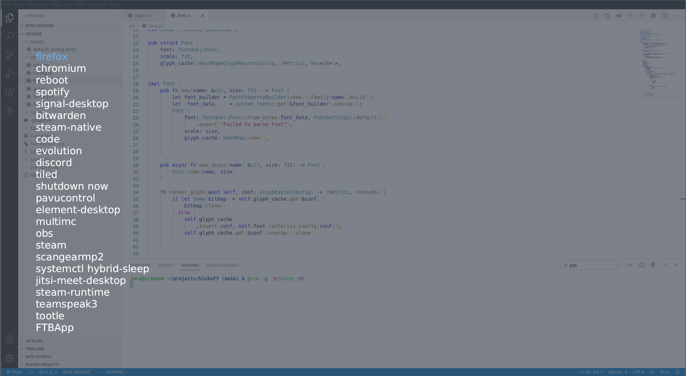

<h1 align="center">
  
</h1>

Kickoff is heavily inspired by rofi, but not without changes made.
Like many programs, kickoff was born from an itch that no existing program seemed to relieve and my desire to learn a lower-level programming language.

[](https://aur.archlinux.org/packages/kickoff/)
[](https://crates.io/crates/kickoff)



## Install

#### Arch Linux
Use your favorite AUR manager, i.e. [blinky](https://github.com/cherti/blinky/):

```bash
blinky -S kickoff
```

#### Cargo

```bash
cargo install kickoff
```

## Features

- Wayland native (only wlroots based compositors though)
- Fuzzy search
- Fast and snappy
- Remembers often used applications
- Argument support for launched programs
- Paste support
- Custom Input via stdin

## How does it search

All programs found in $PATH are included in the search results.
This can include your additions to $PATH as long as they
are done before you launch kickoff or the program that launches kickoff
(i.e. your window manager)

This list is then combined with your previous searches and sorted by the amount of usage
and how well it fits the query.

## Configuration

A default configuration will be placed at `$XDG_CONFIG_HOME/kickoff/config.toml`
or can be found [here](https://github.com/j0ru/kickoff/blob/main/assets/default_config.toml).

## Script integration

If you want to adapt kickoff for your use case, i.e. selecting an entry from a password manager,
you can use one of the `--from-*` options. If any of those options is defined, the default behavior of reading from `$PATH` is disabled as well as
saving the history. The latter can easily be reactivated by setting `--history <some path>`.

|Option|Argument|Usage|
|------|--------|-----|
|`--from-stdin`|None| Reads a list of items from stdin |
|`--from-file`|Path| Reads a list of items from a file |
|`--from-path`|None| Walks all `$PATH` directories and adds all executables as selectable items |
|`--stdout`|None| Prints the selected result to stdout instead of trying to execute it |

These can also be combined, for example, if you want to add custom commands to your usual list of programs.
```bash
echo 'Big kitty = kitty -o "font_size=20"' | kickoff --from-stdin --from-path --history ".cache/kickoff/custom_history.csv"
```

### Input Format

Reading from file or stdin follows a very simple format,
spaces around the equals sign can be dropped:
```
Small kitty = kitty -o "font_size=5"
Big kitty = kitty -o "font_size=20"
^=======^   ^=====================^
    |                  |
Displayed Name         |
                       |
              Executed Command
```

### Magic Words

When reading from a file or stdin, you can use magic words to influence the generated items.
Currently, there is only one, but more might be added someday:

|Word|Argument|Usage|Default|
|----|--------|-----|-------|
|%base_score| number | Sets the base score for all following entries, can be overwritten later | 0 |

In this example, `Small kitty` has a base score of 0, while the others have a score of 5.
```
Small kitty = kitty -o "font_size=5"
%base_score = 5
Big kitty = kitty -o "font_size=20"
Medium kitty = kitty -o "font_size=12"
```
